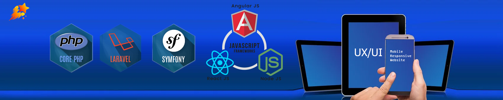

<h1>Hi, This is Tony, Experienced Full Stack Developer. 👋</h1>
<h4><i><a href="https://www.linkedin.com/in/zou-wang-88397519a" target="_blank">My Client says ...</a> "Tony is a very skilled programmer and project manager. I've had the pleasure of working with him, and he's not only a great guy, but he's an excellent problem-solver. We had a platform that was a mess from another programmer when we passed it along, and he was able to assess the situation, make a suggestion, and execute the project on time and on budget. I would recommend considering Tony in the mix should you have a project that is a good fit."  in <strong>Linkedin recommendations</strong>.</h4> </i>

- 🔭 Recently, I have been working on a project aimed at giving our customers the ability to improve the citywave service in our mobile and web apps alongside the existing Citywavemard.com. Although this project has been a very fast-paced and challenging one, it’s been highly rewarding having the chance to work end to end on a project that has complexity not only from the engineering side but also from the product and operations side. And, it’s been even more rewarding knowing that we are building something our customers will use and love from the moment we launch.
- <h2>:star2: Here are my stack.</h2>
    <h3> :wave: <b>Backend</b></h3> 
    <h5> :boom: PHP & Framework : Core PHP, Laravel & Lumen (5.x~8.x), CodeIgniter 2.x,3.x,4.x, Symfony 3.x,4.x,5.x </h4>
    <h5> :fire: ES6 & Framework : Node, Express </h4>
    <h5> :ok_hand: Python & Django </h4>
    
    <h3> :wave: <b>Frontend</b></h3> 
    <h5> :boom: SPA Framework : React, Next, Vue, Angular </h4>
    <h5> :fire: Traditional Stack Based on Dom : Vanila Script, jQuery, Bootstrap, CSS3, HTML</h4>
    
    <h3> :wave: <b>Database</b></h3> 
    <h5> :boom: SQL : Postgre, Mysql, Mariodb </h4>
    <h5> :fire: NoSQL & Cache : Couch, Mongo, Redis</h4>
    
- 🌱 I’m currently learning Gatsby.js and Three.js
- 📫 How to reach me: skype-live:.cid.3c1ad9073f878c5, email: tony.fullstack.dev@gmail.com             
- ⚡ Fun fact: Basketball, Table-tennis, Listening Music.
    

